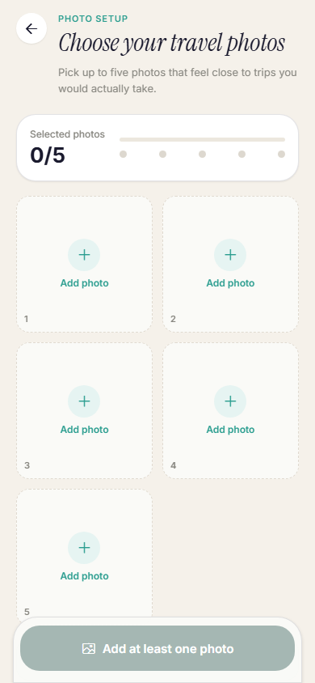
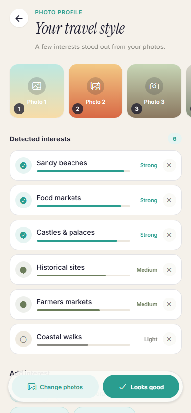

# TripCraft

TripCraft is an AI-assisted travel planning application that builds a traveler profile from an adaptive quiz or photo onboarding flow, recommends destinations, and generates personalized multi-day itineraries.

The project combines a React Native mobile client with a FastAPI backend, PostgreSQL data modeling, recommendation logic, CLIP-based image understanding, and evaluation scripts for measuring recommendation and image-recognition quality.

## Preview

| Photo onboarding | Photo profile review |
|---|---|
|  |  |

## Highlights

- Adaptive travel preference quiz with hierarchical tags and clarification questions.
- Photo onboarding flow that maps user-uploaded travel images to database-backed preference tags.
- Personalized country recommendation and itinerary generation.
- Interactive itinerary mode with attraction details, route points, saved plans, feedback, and regeneration.
- Social features for friends, group trips, and group-aware recommendations.
- ML evaluation suite with precision, recall, NDCG, runtime, and downstream recommendation metrics.
- Alembic-managed database migrations and backend tests for core recommendation behavior.

## Tech Stack

| Area | Technologies |
|---|---|
| Mobile | React Native, Expo Router, Expo SDK, Axios, SecureStore, WebView |
| Backend | FastAPI, SQLAlchemy, Pydantic, Alembic, SlowAPI |
| Data | PostgreSQL, relational tag hierarchy, destination and attraction metadata |
| ML / Ranking | PyTorch, Transformers, CLIP, Sentence Transformers, scikit-learn, NumPy |
| Testing / Evaluation | Pytest, custom recommendation and image-recognition evaluation scripts |

## Repository Structure

```text
tripcraft/
  backend/              FastAPI API, SQLAlchemy models, Alembic migrations, ML services
  mobile/               Expo / React Native mobile app
  docs/                 Architecture notes and database schema artifacts
  stress_test/          Research and stress-testing scripts for recommender behavior
```

## Documentation

- [Setup Guide](docs/SETUP.md)
- [Architecture Overview](docs/ARCHITECTURE.md)
- [Database Schema](docs/database_schema.svg)
- [Backend Migrations](backend/MIGRATIONS.md)
- [ML Evaluation Summaries](backend/evaluation/results/SUMMARY_IMAGE_RECOGNITION_COMPARISON.md)

## Quick Start

Backend:

```powershell
cd backend
python -m venv venv
venv\Scripts\activate
pip install -r requirements-dev.txt
copy .env.example .env
python -m alembic upgrade head
python -m uvicorn app.main:app --reload
```

Mobile:

```powershell
cd mobile
npm install
copy .env.example .env
npx expo start
```

Set `EXPO_PUBLIC_API_URL` in `mobile/.env` to the backend URL reachable by the device or emulator.

## Verification

```powershell
cd backend
venv\Scripts\python.exe -m pytest -q
```

Current local backend test suite: 69 tests passing.

```powershell
cd mobile
npx expo-doctor
```

## Evaluation Snapshot

The image-recognition evaluation compares the previous CLIP pipeline with calibrated prompt-based variants. In the latest checked-in summary, the calibrated prompt run improved NDCG@5 from `0.1327` to `0.7272` and reduced Zero-hit@5 from `0.6809` to `0.0`.

## Production Hardening Notes

This repository is prepared as an academic and portfolio project. Before a public production launch, the main hardening items are:

- Move long-running ML jobs from in-memory state to a persistent queue.
- Store uploaded images in object storage with explicit lifecycle rules.
- Add stricter rate limiting and authentication to expensive ML endpoints.
- Finalize Expo/EAS release configuration and app store identifiers.
- Add CI for backend tests, dependency checks, and mobile validation.
